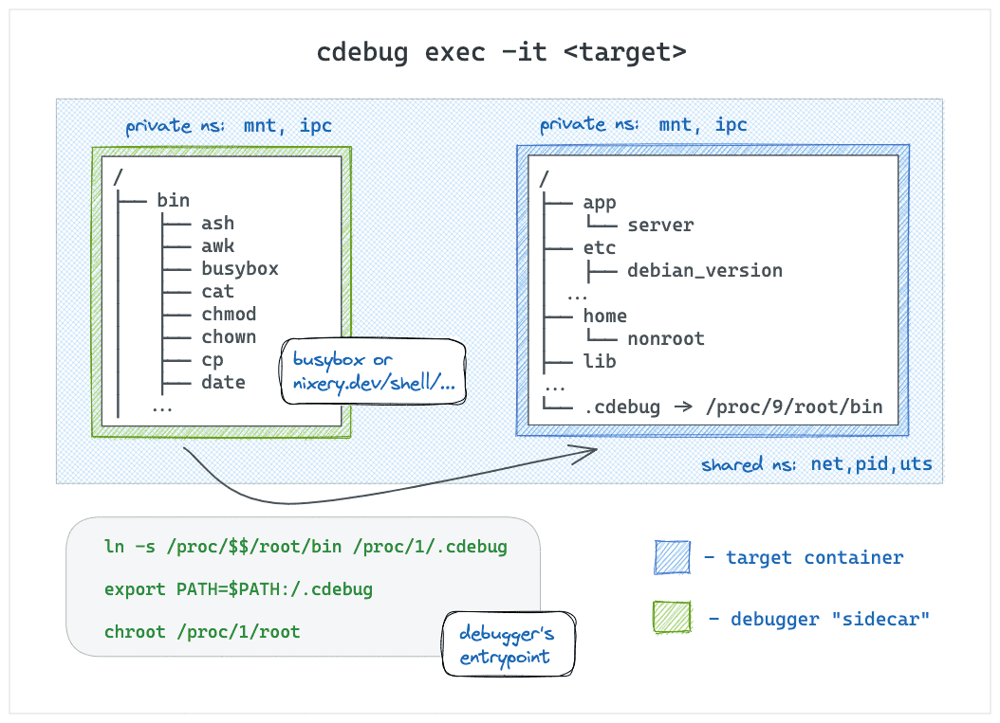
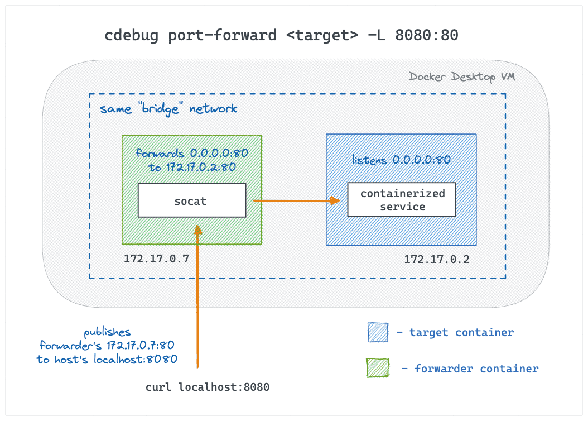
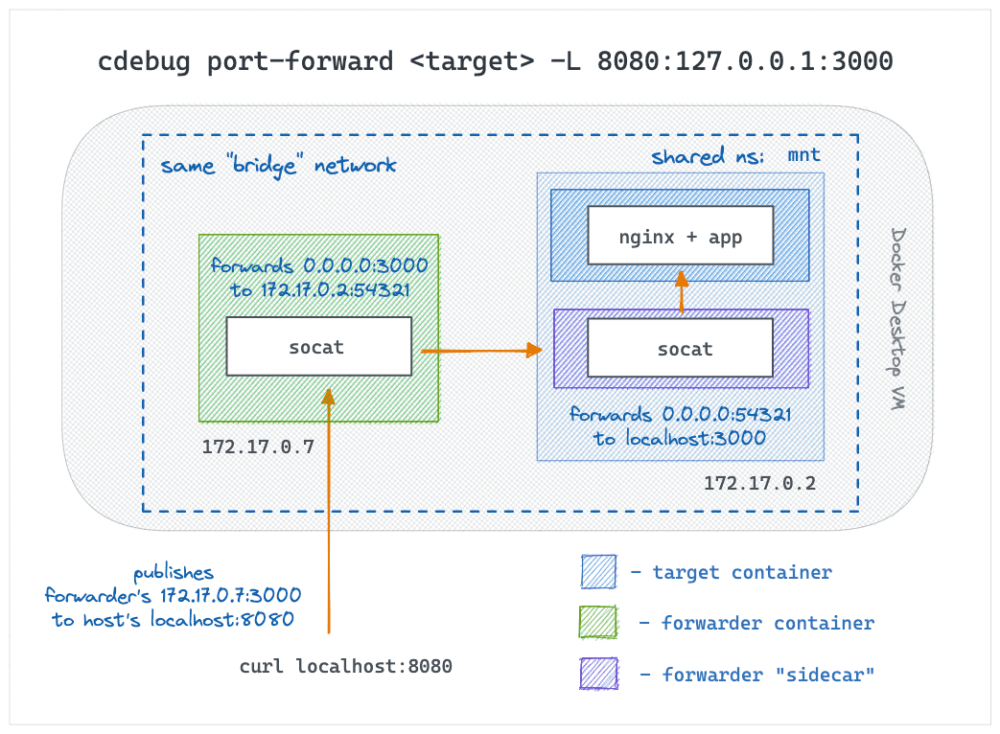

# cdebug - a swiss army knife of container debugging

```diff
! Support development of this project > patreon.com/iximiuz
```

With this tool you can:

- Troubleshoot containers lacking shell and/or debugging tools
- Forward unpublished or even localhost ports to your host system
- Expose endpoints from the host system to containers & Kubernetes networks
- Handily export image's and/or container's filesystem to local folders
- and more :)

The following _commands_ x _runtimes_ are supported:

|                       | Docker | Podman | containerd | Kubernetes | Kubernetes CRI | OCI (runc, crun)  |
| :---                  | :---:  | :---:  | :---:      | :---:      | :---:          | :---:             |
| `exec`                | ✅     | -      | ✅         | -          | -              | -                 |
| `port-forward` local  | ✅     | -      | -          | -          | -              | -                 |
| `port-forward` remote | 🛠️      | -      | -          | 🛠️          | -              | -                |
| `export`              | -      | -      | -          | -          | -              | -                 |

## Installation

It's a statically linked Go binary, so you know the drill:

```sh
GOOS=linux
GOARCH=amd64

curl -Ls https://github.com/iximiuz/cdebug/releases/latest/download/cdebug_${GOOS}_${GOARCH}.tar.gz | tar xvz

sudo mv cdebug /usr/local/bin
```

### Homebrew

If you're a [Homebrew](https://brew.sh/) user, you can install the tool via brew on macOS or Linux:

```sh
$ brew install cdebug
```

At the moment, the following systems are (kinda sorta) supported:

- linux/amd64
- darwin/amd64
- darwin/arm64

## Commands

### cdebug exec

Run an interactive shell in a scratch, slim, or distroless container, with ease:

```sh
cdebug exec -it [docker|containerd://]<container>
```

The `cdebug exec` command is a crossbreeding of `docker exec` and `kubectl debug` commands.
You point the tool at a running container, say what toolkit image to use, and it starts
a debugging "sidecar" container that _feels_ like a `docker exec` session to the target container:

- The root filesystem of the debugger **_is_** the root filesystem of the target container.
- The target container isn't recreated and/or restarted.
- No extra volumes or copying of debugging tools is needed.
- The debugging tools **_are_** available in the target container.

By default, the `busybox:musl` (statically compiled) image is used for the debugger sidecar, but you can override it
with the `--image` flag. Combining this with the superpower of Nix and [Nixery](https://nixery.dev/),
you can get all your favorite tools by simply listing them in the image name:

```
cdebug exec -it --image nixery.dev/shell/ps/vim/tshark <target-container>
```

<details>
<summary>How it works</summary>

The technique is based on the ideas from this [blog post](https://iximiuz.com/en/posts/docker-debug-slim-containers).



Oversimplifying, the debugger container is started like:

```sh
docker run [-it] \
  --network container:<target> \
  --pid container:<target> \
  --uts container:<target> \
  <toolkit-image>
  sh -c <<EOF
ln -s /proc/$$/root/bin/ /proc/1/root/.cdebug

export PATH=$PATH:/.cdebug
chroot /proc/1/root sh
EOF
```

The secret sauce is the symlink + PATH modification + chroot-ing.

</details>

### cdebug port-forward

Forward local ports to containers and vice versa. This command is another crossbreeding -
this time it's `kubectl port-forward` and `ssh -L|-R`.

Currently, only local port forwarding (`cdebug port-forward -L`) is supported,
but remote port forwarding is under active development.

Local port forwarding use cases (works for Docker Desktop too!):

- Publish "unpublished" port 80 to a random port on the host: `cdebug port-forward <target> -L 80`
- Expose container's localhost to the host system: `cdebug port-forward <target> -L 127.0.0.1:5432`
- Proxy local traffic to a remote host via the target: `cdebug port-forward <target> -L <LOCAL_HOST>:<LOCAL_PORT>:<REMOTE_HOST>:<REMOTE_PORT>`
- 🛠️ Expose a Kubernetes service to the host system: `cdebug port-forward <target> -L 8888:my.svc.cluster.local:443`

Remote port forwarding use cases:

- Start a container/Pod forwarding traffic destined to its `<IP>:<port>` to a non-cluster endpoint reachable from the host system.
- ...

<details>
<summary>How it works</summary>

**Local port forwarding** is implemented by starting an extra forwarder container in the
target's network and publishing its ports to the host using the standard means (e.g.,
`docker run --publish`). The forwarder container itself runs something like:

`socat TCP-LISTEN:<REMOTE_PORT>,fork TCP-CONNECT:<REMOTE_HOST>:<REMOTE_PORT>`



If the _REMOTE_HOST_ doesn't belong to the target or it's the target's localhost,
an extra sidecar container is started in the target's network namespace with another
socat forwarding traffic from the target public interface to `REMOTE_HOST:REMOTE_PORT`.



**Remote port forwarding** will use similar tricks but combined with more advanced
reverse tunneling.

</details>

## Examples

Below are a few popular scenarios formatted as reproducible demos.

### A simple interactive shell to a distroless container

First, a target container is needed. Let's use a distroless nodejs image for that:

```sh
$ docker run -d --rm \
  --name my-distroless gcr.io/distroless/nodejs \
  -e 'setTimeout(() => console.log("Done"), 99999999)'
```

Now, let's start an interactive shell (using busybox) into the above container:

```sh
$ cdebug exec -it my-distroless
```

Exploring the filesystem shows that it's a rootfs of the nodejs container:

```sh
/ $# ls -lah
total 60K
drwxr-xr-x    1 root     root        4.0K Oct 17 23:49 .
drwxr-xr-x    1 root     root        4.0K Oct 17 23:49 ..
👉 lrwxrwxrwx 1 root     root          18 Oct 17 23:49 .cdebug-c153d669 -> /proc/55/root/bin/
-rwxr-xr-x    1 root     root           0 Oct 17 19:49 .dockerenv
drwxr-xr-x    2 root     root        4.0K Jan  1  1970 bin
drwxr-xr-x    2 root     root        4.0K Jan  1  1970 boot
drwxr-xr-x    5 root     root         340 Oct 17 19:49 dev
drwxr-xr-x    1 root     root        4.0K Oct 17 19:49 etc
drwxr-xr-x    3 nonroot  nonroot     4.0K Jan  1  1970 home
drwxr-xr-x    1 root     root        4.0K Jan  1  1970 lib
drwxr-xr-x    2 root     root        4.0K Jan  1  1970 lib64
drwxr-xr-x    5 root     root        4.0K Jan  1  1970 nodejs
...
```

Notice 👉  above - that's where the debugging tools live:

```sh
/ $# echo $PATH
/usr/local/sbin:/usr/local/bin:/usr/sbin:/usr/bin:/sbin:/bin:/.cdebug-c153d669
```

The process tree of the debugger container is the process tree of the target:

```sh
/ $# ps auxf
PID   USER     TIME  COMMAND
    1 root      0:00 /nodejs/bin/node -e setTimeout(() => console.log("Done"),
   13 root      0:00 sh -c  set -euo pipefail  sleep 999999999 & SANDBOX_PID=$!
   19 root      0:00 sleep 999999999
   21 root      0:00 sh
   28 root      0:00 [sleep]
   39 root      0:00 [sleep]
   45 root      0:00 ps auxf
```

### An interactive shell with code editor (vim)

If the tools provided by busybox aren't enough, you can bring your own tools with
a ~~little~~ huge help of the [nixery](https://nixery.dev/) project:

```sh
$ cdebug exec -it --image nixery.dev/shell/vim my-distroless
```

### An interactive shell with tshark and other advanced tools

Even more powerful exammple:

```sh
$ cdebug exec -it --image nixery.dev/shell/ps/findutils/tshark my-distroless
```

### Debugging containerd containers (no Docker required)

First, start the target container:

```sh
$ sudo ctr image pull docker.io/library/nginx:latest
$ sudo ctr run -d docker.io/library/nginx:latest nginx-1
```

Run an interactive shell in the target container using simple `cdebug exec`:

```
$ sudo cdebug exec -it containerd://nginx-1
/ $# wget -O- 127.0.0.1
```

Run VIM in the target container using `cdebug exec --image nixery.dev/shell/vim`:

```sh
$ sudo cdebug exec -it --rm --image nixery.dev/shell/vim containerd://nginx-1
```

### Debugging nerdctl containers (no Docker required)

Start a container using nerdctl:

```sh
$ sudo $(which nerdctl) run -d --name nginx-1 nginx
9f8763d82259a6e3e747df83d0ce8b7ee3d33d94269a72cd04e0e3862a3abc5f
```

Run the debugger using the `nerdctl://` schema and the target's name:

```sh
$ sudo cdebug exec -it --rm nerdctl://nginx-1
```

Or run a debugging session in the above container using the `containerd://` schema:

```sh
$ sudo cdebug exec -it --rm containerd://9f876
```

### Debugging Kubernetes Pods (node access is assumed)

Currently, only containerd CRI is supported. First, you'll need to list the running
containers:

```sh
$ ctr -n k8s.io container ls
CONTAINER       IMAGE                                       RUNTIME
155227c0e9aa8   k8s.gcr.io/pause:3.5                        io.containerd.runc.v2
2220eacd9cb26   registry.k8s.io/kube-apiserver:v1.25.3      io.containerd.runc.v2
22efcb35a651a   registry.k8s.io/etcd:3.5.4-0                io.containerd.runc.v2
28e06cc63b822   docker.io/calico/cni:v3.24.1                io.containerd.runc.v2
30754c8492f18   docker.io/calico/node:v3.24.1               io.containerd.runc.v2
61acdb0231516   docker.io/calico/kube-controllers:v3.24.1   io.containerd.runc.v2
...
```

Now you can exec into a Pod's container bringing your own debugging tools:

```sh
$ cdebug exec -n k8s.io -it --rm containerd://2220ea
```

### Publish "forgotten" port

Start an nginx container but don't expose its port 80:

```sh
$ docker run -d --name nginx-1 nginx:1.23
```

Forward local port 8080 to the nginx's 80:

```sh
$ cdebug port-forward nginx-1 -L 8080:80
$ curl localhost:8080
```

### Expose localhost's ports

Start a containerized service that listens only on its localhost:

```sh
$ docker run -d --name svc-1 python:3-alpine python3 -m 'http.server' -b 127.0.0.1 8888
```

Tap into the above service:

```sh
$ cdebug port-forward svc-1 -L 127.0.0.1:8888
Pulling forwarder image...
latest: Pulling from shell/socat
Digest: sha256:b43b6cf8d22615616b13c744b8ff525f5f6c0ca6c11b37fa3832a951ebb3c20c
Status: Image is up to date for nixery.dev/shell/socat:latest
Forwarding 127.0.0.1:49176 to 127.0.0.1:8888 through 172.17.0.4:34128

$ curl localhost:49176
<!DOCTYPE HTML>
<html lang="en">
<head>
...
```

## F.A.Q

**Q:** Running `cdebug exec` fails with `rm: cannot remove '/proc/1/root/nix': Permission denied` or
`ln: /proc/1/root/.cdebug-XXXXXXXX: Permission denied`.

Chances are your target container has been started with elevated permissions while you're trying to run a non-privileged debugger sidecar. Try `cdebug exec --privileged` instead.

## Similar tools

- [`slim debug`](https://github.com/slimtoolkit/slim) - a `debug` command for Slim(toolkit) (originally contributed by [D4N](https://github.com/D4N))
- [`debug-ctr`](https://github.com/felipecruz91/debug-ctr) - a debugger that creates a new container out of the original container with the toolkit mounted in a volume (by [Felipe Cruz Martinez](https://github.com/felipecruz91))
- [`docker-debug`](https://github.com/zeromake/docker-debug) - much like `cdebug exec` but without the chroot trick.
- [`docker-opener`](https://github.com/artemkaxboy/docker-opener) - a multi-purpose tool that in particular can run a shell session into your container (and if there is no shell inside, it'll bring its own busybox).
- [`cntr`](https://github.com/Mic92/cntr) - is "a replacement for `docker exec` that brings all your developers tools with you" by mounting the file system from one container (or the host) into the target container and creating a nested container with the help of a FUSE filesystem. Supports a huge range of runtimes (docker, podman, LXC/LXD, rkt, systemd-nspawn, containerd) because it operates on the OS level.
- [`kdiag`](https://github.com/solo-io/kdiag) - a kubectl plugin to get shell access to scratch containers, stream logs from multiple pods simultaneously, and do reverse port forwarding to Kubernetes clusters.

## TODO:

- More `exec` flags (like in `docker run`): `--cap-add`, `--cap-drop`, `--env`, `--volume`, etc.
- Helper command(s) suggesting nix(ery) packages
- Non-docker runtimes (containerd, runc, k8s)
- More E2E Tests

## Contributions

It's a pre-alpha with no sound design yet, so I may not be accepting all PRs. Sorry about that :)
